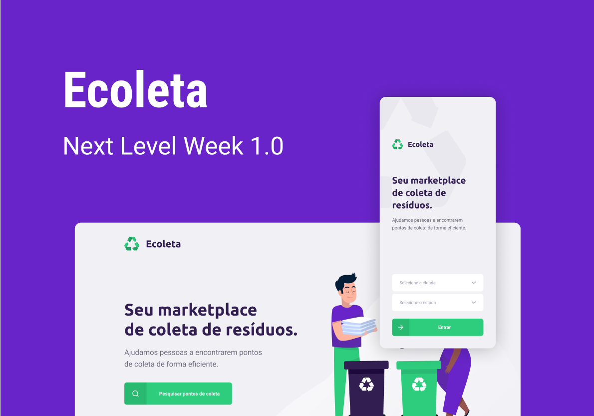

<h3 align="center">
    
    <br><br>
    <br>
</h3>
    
<h3 align="center">
     :recycle: Next Level Week #01 :recycle:
    <br><br>
    <br>
</h3>
    
## 💻 Project

Ecoleta is a project developed based on international environment week. 
That aims to help people find/or register companies that collect specific waste such as light bulbs, batteries, cooking oil, etc.

<h1 align="center">
    
</h1>

## :rocket: Technologies

This project was developed using the following technologies:

-<a href="https://nodejs.org/en/" target="_blank">Node.js</a> </br>
-<a href="https://www.typescriptlang.org/" target="_blank">TypeScript</a> </br>
-<a href="https://reactjs.org/" target="_blank">React JS</a> </br>
-<a href="https://reactnative.dev/" target="_blank">React Native</a> </br>
-<a href="https://expo.io/" target="_blank">Expo</a> </br>

## :information_source: How to Use

To clone and run this application, you'll need [Git](https://git-scm.com), [Node.js][https://nodejs.org/en/] + [Yarn][https://yarnpkg.com/] installed on your computer.
    
### Install API

```bash
# Clone this repository
$ git clone https://github.com/joaoficanha/ecoleta.git

# Go into the repository
$ cd ecoleta/server

# Install dependencies
$ yarn install

# Run Migrates
$ yarn knex:migrate

# Run Seeds
$ yarn knex:seed

# Start server
$ yarn dev

# running on port 3333
```

### Install Web-App

```bash
# Clone this repository
$ git clone https://github.com/joaoficanha/ecoleta.git

# Go into the repository
$ cd ecoleta/web-app

# Install dependencies
$ yarn install

# Run
$ yarn start

# running on port 3000
```

### Install Mobile

```bash
# Clone this repository
$ git clone https://github.com/joaoficanha/ecoleta.git

# Go into the repository
$ cd ecoleta/mobile

# Install dependencies
$ yarn install

# Run
$ yarn start

# Expo will open, just scan the qrcode on terminal or expo page

```
## :memo: License

This project is under the MIT license. See the [LICENSE](LICENSE.md) for details.

Made by <a href="https://www.linkedin.com/in/joão-pedro-ficanha-25a5b0167/" target="_blank">João Pedro Ficanha</a>
